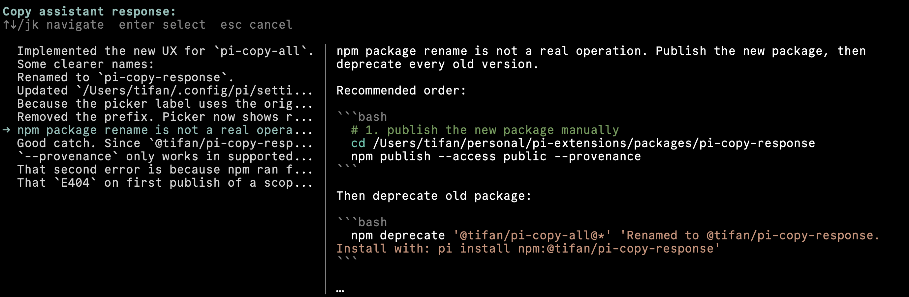

# @tifan/pi-copy-response

Pick one assistant response from the current pi session, preview it, then copy it to the system clipboard.



Use this when pi's built-in `/copy` is not enough. `/copy` copies only the last assistant response. This extension lets you choose an older response and preview the full text before copying it.

## Install

```bash
pi install npm:@tifan/pi-copy-response
```

## Commands

- `/copy-response`: Open a response picker, preview the selected assistant response on the right, and copy it.

The picker hides pi's footer while it is open, so long previews have more room.

## License

[MIT](LICENSE)
