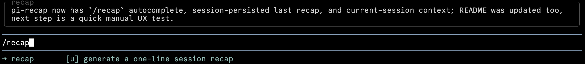

# @tifan/pi-recap

Show a one-line session recap on demand or after you have been away.

`pi-recap` helps you re-enter a session without rereading the transcript. It summarizes the current session state, important decisions, relevant files or commands, and the likely next action.



## Install

```bash
pi install npm:@tifan/pi-recap
```

## Behavior

- `/recap` generates a fresh recap and shows it above the editor.
- After each agent response, `pi-recap` waits 5 minutes. If you stay idle, it generates one automatic recap.
- On resume, `pi-recap` shows the saved recap if it is current. If it is stale or missing, it generates a fresh recap.
- The recap clears when you send a non-`/recap` message.

## Context

Recaps use pi's current session context. That means they follow the active branch and respect compaction.

`pi-recap` does not scrape the full session file or terminal history. It summarizes the same branch-aware, compaction-aware messages that pi keeps in context.

The latest recap is stored as a custom session entry. Recap entries do not participate in LLM context.

`/recap status` reports whether the stored recap is current, stale, or missing.

## Commands

- `/recap`: Generate and show a fresh recap.
- `/recap status`: Show selected model, active model, recap freshness, and whether the recap is visible.
- `/recap help`: List recap commands.

Subcommands appear in autocomplete when you type `/recap `.

## Configuration

Set the recap model in `~/.config/pi/extensions/pi-recap.json`:

```json
{
  "model": "openai-codex/gpt-5.4-mini"
}
```

Use `auto` or omit the key to fall back to the first available model from this list:

1. `openai-codex/gpt-5.4-mini`
2. `openai-codex/gpt-5.3-codex-spark`
3. `anthropic/claude-haiku-4-5`
4. `anthropic/claude-haiku-4-5-20251001`

## License

[MIT](LICENSE)
